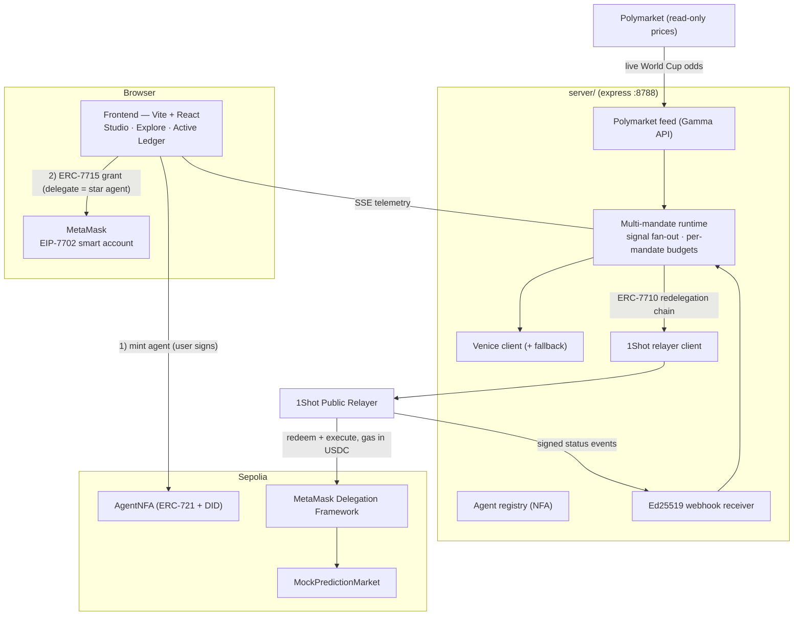

# PolyForge — a no-code launchpad for self-custodial AI prediction-market agents

**Mint an AI agent as an NFT, grant it a scoped on-chain budget with one MetaMask signature, and watch it trade real Polymarket markets autonomously — gasless, bounded, and revocable.**

Built for the **MetaMask Smart Accounts Kit × 1Shot API × Venice AI Dev Cook Off**.

PolyForge turns "an AI agent" from a black-box bot into a **first-class on-chain asset**: a reusable brain (AgentNFA, ERC-721 + on-chain DID) that any user can instantiate as a **Mandate** — a running instance bound to their wallet by an ERC-7715 Advanced Permission. The agent then redeems ERC-7710 delegations through the 1Shot permissionless relayer to bet on a Sepolia prediction market mirroring live Polymarket prices — without the user ever holding ETH or signing another transaction.

---

## Why this matters

Two things just became possible at the same time:

1. **Smart accounts are composable.** ERC-7715 lets a dApp request a *fine-grained, expiring* permission from a user; ERC-7710 lets an agent *re-delegate* a narrower slice of that permission to another agent.
2. **Gas abstraction is real.** The 1Shot relayer redeems those delegations and takes its fee in stablecoins — the user holds **0 ETH**.

PolyForge puts them together: **grant once, the agent runs autonomously within on-chain caveats, you keep custody and can revoke at any time.**

---

## What's live on-chain (Sepolia) — verifiable now

| Thing | Address / tx |
|---|---|
| **AgentNFA** (ERC-721 agent identity + DID) | [`0xB0Bf71Bd0AA1c73e649b0f482229d135B95107d0`](https://sepolia.etherscan.io/address/0xB0Bf71Bd0AA1c73e649b0f482229d135B95107d0) |
| **MockPredictionMarket** (mirrors Polymarket) | [`0xF1EE83A565d4F4007028de3C5E29b01FfAD64476`](https://sepolia.etherscan.io/address/0xF1EE83A565d4F4007028de3C5E29b01FfAD64476) |
| 1Shot relayer target (Sepolia) | `0x02c9979a75fbdbc3a77485024ab8b6474308591e` |
| **2-hop redelegation + EIP-7702 upgrade + Ed25519 webhooks** (spike proof) | [`0x72a9…7b5a`](https://sepolia.etherscan.io/tx/0x72a9546032e68db8680f5745031a0d8ddf413db7cf111aabbbc2744f57ae7b5a) |
| **Real MetaMask 7715 grant → gasless bet** (browser flow) | [`0x6684…7a23`](https://sepolia.etherscan.io/tx/0x6684cbcfb5033eb635b7764b6436db85f4b337486e3d1728b50a1eb4fa927a23) |
| **Two concurrent agents, opposite bets, both confirmed** | [`0x81df…f74c`](https://sepolia.etherscan.io/tx/0x81dfe1b60a4ed8542f4aa528d8c4daf975e33788cc90587b5acef4029429f74c) · [`0xe4d3…f7ff`](https://sepolia.etherscan.io/tx/0xe4d35d2bbf40f481be1f8f13691479a722f9674269f5e5ab99fb94f239a0f7ff) |

On-chain DID example: `did:nfa:11155111:0xb0bf71bd0aa1c73e649b0f482229d135b95107d0:1`

---

## How we hit the tracks

| Track | What we built | Evidence |
|---|---|---|
| **Best Use of 1Shot Relayer** | EIP-7702 EOA→smart-account upgrade *through the relayer*; gas paid in USDC (user 0 ETH); **Ed25519-verified webhooks** (not polling); estimate-converge fee loop | tx `0x72a9…`, webhooks verified against `/.well-known/jwks.json` |
| **Best A2A coordination** | ERC-7710 **redelegation**: user → star agent → follower agent → relayer, each hop narrowing the caveats; "copy an agent" spawns a 3-hop follower mandate | `redelegateViaFollower` in [`server/chain.ts`](server/chain.ts); leaf-first `permissionContext` |
| **Best Agent** | Autonomous agent whose ERC-7715 permission is *central* to the UX (one signature, then hands-off); agent identity is a real ERC-721 (AgentNFA) with on-chain DID; **multiple agents run concurrently** | AgentNFA + multi-mandate runtime; gated (public/private) execution |
| **Best Use of Venice AI** | Decision brain on Venice's OpenAI-compatible API (privacy-first inference); model selected per agent | [`server/venice.ts`](server/venice.ts) — see honesty note below |

**Honesty notes (judges asked for non-cosmetic integrations):**
- **Venice**: fully integrated via the OpenAI-compatible endpoint; in our testing the API key had **no credits (HTTP 402)**, so the loop ran its **deterministic fallback engine** (telemetry labels every decision `venice` vs `fallback`). Swapping to live Venice is one populated env var — no code change.
- **A2A copy** currently re-delegates between **backend-held agent keys** (same operator) — a real ERC-7710 redelegation chain, proven on-chain. *Cross-user* copy (your follower copying a stranger's agent) is a roadmap item.
- **x402** is **not** implemented; it's on the roadmap (subscription / per-inference micropayments from the delegated budget). We did not claim this track.

---

## Architecture



### The core idea: **Agent ≠ Mandate**

- **Agent (brain)** = an `AgentNFA` token: model + prompt commitment (`configHash`) + on-chain DID. Reusable, ownable, discoverable, gated (public/private).
- **Mandate (run)** = a user's guardrails (per-match cap, daily allowance, expiry) + execution config, bound to an Agent by an ERC-7715 grant. Many mandates run **concurrently**, each with its own budget; market signals fan out to all of them.

The Studio reflects this: **Step 1 — Create your Agent**, **Step 2 — Launch a Mandate**.

---

## The delegation chain (A2A)

```
User (7702 smart account)
  │  ERC-7715 grant — erc20-token-periodic, delegate = Star Agent A
  ▼
Star Agent A
  │  ERC-7710 redelegation — narrower scope (smaller cap / shorter expiry)
  ▼
Follower Agent B           (copy-trade)
  │  ERC-7710 redelegation — narrower still
  ▼
1Shot relayer target  →  redeemDelegations → USDC moves from the user account, gas paid by relayer
```

`permissionContext` is **leaf-first** (`[leaf, …root]`) — confirmed empirically. Caveat enforcers are real and per-hop: an over-budget bundle reverts with `ERC20TransferAmountEnforcer:allowance-exceeded` at estimate time. **A hijacked agent brain still cannot exceed the on-chain budget.**

---

## Tech stack

- **Frontend**: Vite 6, React 19, Tailwind 4, viem 2, `@metamask/smart-accounts-kit`
- **Server**: Express, SSE telemetry, in-memory state (no DB by design)
- **Contracts**: Solidity 0.8.24, self-contained (no OZ dep), compiled with solc-js
- **Chains/infra**: Ethereum Sepolia, 1Shot Public Relayer (`relayer.1shotapi.dev`), Polymarket Gamma API (read-only), Venice AI (OpenAI-compatible)

---

## Run locally

Prereqs: Node ≥ 20, a funded Sepolia operator key, (optional) Venice API key.

```bash
npm install
cp .env.example .env.local   # then fill keys (see below)

# one-time: compile + deploy contracts to Sepolia
npm run compile:contracts
npm run deploy:market        # → MARKET_ADDRESS in .env.local
npm run deploy:nfa           # → AGENT_NFA_ADDRESS in .env.local (+ seeds 3 agents)

# run
npm run server               # express + Polymarket feed + webhook tunnel on :8788
npm run dev                  # frontend on :3000  (vite proxies /api → :8788)
```

`.env.local`:

```
SPIKE_USER_PK=0x…      # the "user" smart account (headless demo); holds Sepolia USDC
SPIKE_AGENT_A_PK=0x…   # star agent / backend operator (pays operator gas)
SPIKE_AGENT_B_PK=0x…   # follower agent (A2A copy)
VENICE_API_KEY=…       # optional — falls back to a deterministic engine if absent/unfunded
MARKET_ADDRESS=0x…     # written by deploy:market
AGENT_NFA_ADDRESS=0x…  # written by deploy:nfa
```

> **Network note:** behind a proxy, Node's fetch ignores `HTTPS_PROXY` by default — `npm run server` sets `NODE_USE_ENV_PROXY=1` (no-op without a proxy). The default Sepolia RPC round-robin can return stale reads for freshly-deployed contracts, so we pin `ethereum-sepolia-rpc.publicnode.com` (override with `SEPOLIA_RPC`).

---

## What's real vs simulated vs roadmap

| Real (on-chain / live) | Simulated (disclosed) | Roadmap |
|---|---|---|
| ERC-7715 grant, ERC-7710 redelegation, EIP-7702 upgrade, gasless redemption, Ed25519 webhooks | World Cup match feed (scripted + manual inject) | x402 subscription / per-inference payments |
| AgentNFA mint, DID, gated execution | Mirror prediction market (own contract, not Polymarket CLOB) | Real Polymarket CLOB adapter (mainnet, CTF Exchange V2 EIP-1271) |
| **Real Polymarket prices** (Gamma API) drive the odds | — | Revenue share / copy fees to NFA owners |
| Multiple concurrent agents, per-agent budgets | Venice runs fallback when API has no credits | Cross-user A2A; per-agent TEE-held keys |

---

## Engineering notes (the hard parts)

Diagnostic spikes live in [`spike/`](spike/):

- **Relayer masks reverts as `data:0x0`.** A browser-grant bet reverted with no reason. We reproduced the exact `redeemDelegations` via offline `eth_call` ([`spike/04-replay-grant.ts`](spike/04-replay-grant.ts)) and found the cause: the relayer executes multi-execution bundles as a **batch**, which the caveat enforcers reject (`CaveatEnforcer:invalid-call-type`). **Fix:** split fee + bet into separate single-execution `transactions[]` entries so the relayer redeems multi-single.
- **Concurrent redemptions from one EIP-7702 account conflict** on internal exec state → serialize relayer sends per bettor; serialize agentA operator txs (nonce safety).
- **MetaMask 7715 grant fails on "batch upsert user storage"** when its profile-sync backend is unreachable → disable *Backup & sync*.

These (and the `0x0`-revert opacity) are written up as **hackathon feedback**.

---

## License

MIT.
