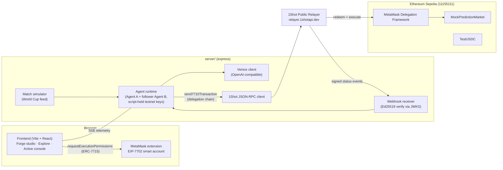
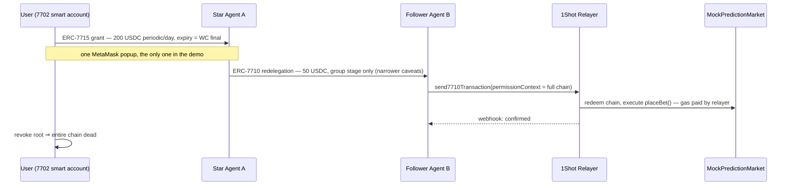

# PolyForge Architecture

> **Status:** v0.2 skeleton — locked 2026-06-11. Sections marked ⏳ are pending validation by the technical spike (§5). This document is intentionally one page: every decision here is one that would be expensive to reverse mid-sprint; everything else is decided in code.

## 1. What PolyForge is

A no-code launchpad where users assemble **prediction-market betting agents** they actually control:

- **Custody stays with the user.** Agents act under [ERC-7715 Advanced Permissions](https://docs.metamask.io/smart-accounts-kit/) with on-chain caveats — per-period budget, total allowance, expiry, target allowlist. Even a fully compromised agent brain cannot exceed them. The off-chain gateway check is defense-in-depth, not the security boundary.
- **Agents coordinate via ERC-7710 redelegation (A2A).** A star agent holding a user delegation re-delegates a *narrower* slice (smaller budget, shorter expiry) to a follower agent. Revoking the root kills the whole chain.
- **Execution is gasless.** The [1Shot Permissionless Relayer](https://1shotapi.com/docs) redeems delegation chains via `relayer_send7710Transaction`; accounts are upgraded with EIP-7702 through the relayer; fees are paid in ERC-20; status arrives via Ed25519-signed webhooks (no polling).
- **The agent brain is Venice AI** (privacy-first, OpenAI-compatible) — match signals go in, bet decisions come out, nothing is logged or trained on.

## 2. System diagram

### Delegation topology (the A2A core)

## 3. Locked decisions

| # | Decision | Choice | Why |
|---|----------|--------|-----|
| D1 | Repo layout | Single repo, plain directories (`src/` `server/` `contracts/` `docs/`). No workspace tooling. | AI Studio template already ships express/dotenv/tsx in the root package; 3.5 days — every layer of indirection is a liability. `contracts/` keeps its own package.json (Hardhat). |
| D2 | Chain | **Ethereum Sepolia** (11155111); fallback Base Sepolia (84532). | Only two testnets the 1Shot public relayer supports (`relayer.1shotapi.dev`). NOT Arbitrum Sepolia. Real Polymarket (Polygon CLOB, off-chain signed orders, proxy wallets) is mainnet roadmap, out of hackathon scope. |
| D3 | Agent keys | Two script-held testnet private keys in `server/` (`privateKeyToAccount`). | Demo-grade. Production roadmap: TEE-held keys (0G TeeML lineage from OmniVault). The on-chain caveats — not key custody — are the user's protection. |
| D4 | FE/BE boundary | Venice API key, agent loop, 1Shot calls, webhook receiver live only in `server/`. Frontend gets an SSE telemetry stream feeding the existing ActiveConsole UI. | No secrets in the browser; SSE maps 1:1 onto the prototype's TelemetryLog model. |
| D5 | Webhooks | Local express route + cloudflared tunnel for the demo recording. | Documented relayer scoring point ("webhooks over polling") with zero deploy overhead. |
| D6 | Market | Self-deployed `MockPredictionMarket` + `TestUSDC` on Sepolia, driven by a scripted World Cup match simulator. | Consistent with the demo plan (simulated live feed); judges score the delegation rails, not the odds engine. |

## 4. Permission model (maps UI form → real ERC-7715 types)

| UI field | ERC-7715 permission type | Note |
|---|---|---|
| Daily betting budget | ERC-20 **periodic** | Production MetaMask ≥ 13.23, no Flask needed |
| Total cap | ERC-20 **allowance** | MetaMask ≥ 13.32.1 |
| Expiry (WC final day) | permission expiry | |
| ~~"Max daily loss"~~ | — not expressible on-chain (loss depends on outcomes) | UI says "budget", never "loss limit" |

## 5. ⏳ Spike hypotheses (validate before building on top)

| ID | Hypothesis | Track at stake | Status |
|----|-----------|----------------|--------|
| H1 | Relayer accepts `permissionContext` with ≥ 2 delegations (multi-hop chain) | Best A2A ($3k) | ✅ **proven on-chain 2026-06-11** — 2-hop chain `user → agentA → relayer target` redeemed in [Sepolia tx `0x72a9…7b5a`](https://sepolia.etherscan.io/tx/0x72a9546032e68db8680f5745031a0d8ddf413db7cf111aabbbc2744f57ae7b5a) (block 11035643, 482,479 gas). Ordering is **leaf-first** (`[leaf, root]`); root-first rejected with an explicit relayer error. |
| H2 | A delegation granted to Agent A can be re-delegated via `createDelegation` + parent authority, and the chain redeems | Best A2A | ✅ proven — EOA agent signed the redelegation with standalone `signDelegation()`; executed in the same tx. SDK also exposes `parentPermissionContext` for redelegating straight from a 7715 grant context (the browser-flow path). |
| H3 | EIP-7702 EOA→smart-account upgrade executes through the relayer | Best Use of Relayer ($1k) | ✅ proven — user EOA code is now `0xef0100…` (StatelessDeleGator), upgrade rode the same relayer tx, gas paid in USDC, account held **0 ETH throughout**. One `authorizationList` entry per request. |
| H4 | Webhook events arrive and verify against `/.well-known/jwks.json` (Ed25519) | Best Use of Relayer | ✅ proven — 2/2 events (type 4 submitted → type 0 confirmed) received through a cloudflared tunnel and **Ed25519-verified** against the dev JWKS using sorted-key canonical JSON. `memo` correlation echoed on every event. |

### Full product loop — proven live 2026-06-12

The complete pipeline ran end-to-end on Sepolia (headless mode):
goal event → Venice decision (fallback engine) → ERC-7715 guardrail check → **2-hop redelegation bundle** → fee converged in 3 estimate rounds (12.53 USDC) → `relayer_send7710Transaction` → **2/2 Ed25519-verified webhooks** → budget transfer [`0x68e0…2157`](https://sepolia.etherscan.io/tx/0x68e0140030a5c5c3a205efddb420643f6531bc9e5f0735f925998cb6e6492157) → operator attribution [`0x874f…eea8`](https://sepolia.etherscan.io/tx/0x874f5ffc39c0349c2867b88d81e1c5cfc8f65389356c646e60182b43cd60eea8) → position OPEN. User native gas: **0 ETH**.

Two production findings from getting there:

- **D7 — operator rail off the relayer.** `recordBet`/`resolve` are backend admin calls sent as plain agentA transactions (agentA keeps a little ETH from deploy). Two reasons, both observed live: a non-transfer call batched under an `Erc20TransferAmount` enforcer reverts with `invalid-execution-length`, and carrying a second relayer entry tripled bundle gas (700k vs 469k → 22 vs 13 USDC fee). The *user* money rail stays 100% relayer-redeemed and gasless — which is what the tracks judge.
- **Root budget depletes cumulatively on-chain.** The `ERC20TransferAmountEnforcer` decrements the root delegation's cap across redemptions: bet #2 was rejected with `allowance-exceeded` once `Σ(fee+bet)` crossed the cap. This is the product story working as designed (a real spending budget, not a per-tx check) — size demo budgets accordingly (~15 USDC consumed per bet at current testnet fees).

**Spike findings worth designing around** (`spike/01-probe-chain.ts`, `spike/02-send-webhook.ts`):

- **Caveat enforcement is real and per-hop**: when the relayer fee pushed total transfers past the root delegation's budget, the on-chain `ERC20TransferAmountEnforcer` reverted with `allowance-exceeded` at estimate time. This is the "hijacked AI can't exceed its budget" demo, observed live — keep it in the pitch.
- **Testnet fee economics**: ~6.2 USDC per bundle (includes the one-time 7702 upgrade; later bundles are cheaper). One bundle can carry **multiple executions** (fee + N bets) — batch bets per bundle in the demo to stretch the faucet's 20 USDC / 2h.
- **Fees drift between estimates** — converge with a re-sign loop (estimate → rebuild at `requiredPaymentAmount` → re-estimate, ≤4 rounds).
- Zero-cost structural validation: `relayer_estimate7710Transaction` validates the full delegation chain before any funding — use it as the pre-flight check in the gateway.

## 6. Non-goals (hackathon)

Real Polymarket CLOB adapter · multi-chain abstraction · database (in-memory + JSON file) · standalone "gateway SDK" package · performance-fee contracts · drag-and-drop canvas (3-step form is the no-code story) · ERC-8004 registration (README roadmap only).
