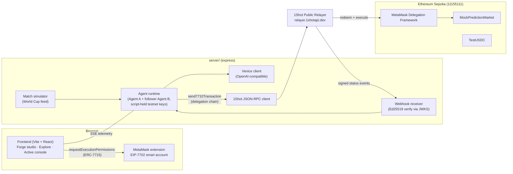
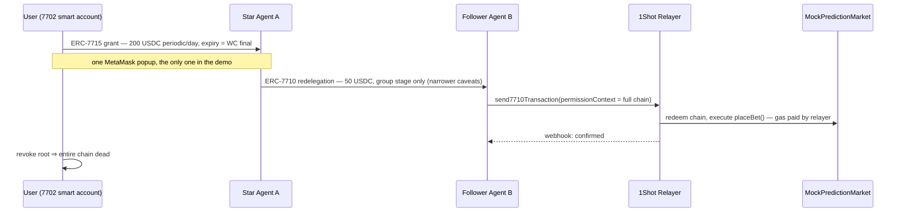

# PolyForge Architecture

> **Status:** v0.2 skeleton — locked 2026-06-11. Sections marked ⏳ are pending validation by the technical spike (§5). This document is intentionally one page: every decision here is one that would be expensive to reverse mid-sprint; everything else is decided in code.

## 1. What PolyForge is

A no-code launchpad where users assemble **prediction-market betting agents** they actually control:

- **Custody stays with the user.** Agents act under [ERC-7715 Advanced Permissions](https://docs.metamask.io/smart-accounts-kit/) with on-chain caveats — per-period budget, total allowance, expiry, target allowlist. Even a fully compromised agent brain cannot exceed them. The off-chain gateway check is defense-in-depth, not the security boundary.
- **Agents coordinate via ERC-7710 redelegation (A2A).** A star agent holding a user delegation re-delegates a *narrower* slice (smaller budget, shorter expiry) to a follower agent. Revoking the root kills the whole chain.
- **Execution is gasless.** The [1Shot Permissionless Relayer](https://1shotapi.com/docs) redeems delegation chains via `relayer_send7710Transaction`; accounts are upgraded with EIP-7702 through the relayer; fees are paid in ERC-20; status arrives via Ed25519-signed webhooks (no polling).
- **The agent brain is Venice AI** (privacy-first, OpenAI-compatible) — match signals go in, bet decisions come out, nothing is logged or trained on.

## 2. System diagram

### Delegation topology (the A2A core)

## 3. Locked decisions

| # | Decision | Choice | Why |
|---|----------|--------|-----|
| D1 | Repo layout | Single repo, plain directories (`src/` `server/` `contracts/` `docs/`). No workspace tooling. | AI Studio template already ships express/dotenv/tsx in the root package; 3.5 days — every layer of indirection is a liability. `contracts/` keeps its own package.json (Hardhat). |
| D2 | Chain | **Ethereum Sepolia** (11155111); fallback Base Sepolia (84532). | Only two testnets the 1Shot public relayer supports (`relayer.1shotapi.dev`). NOT Arbitrum Sepolia. Real Polymarket (Polygon CLOB, off-chain signed orders, proxy wallets) is mainnet roadmap, out of hackathon scope. |
| D3 | Agent keys | Two script-held testnet private keys in `server/` (`privateKeyToAccount`). | Demo-grade. Production roadmap: TEE-held keys (0G TeeML lineage from OmniVault). The on-chain caveats — not key custody — are the user's protection. |
| D4 | FE/BE boundary | Venice API key, agent loop, 1Shot calls, webhook receiver live only in `server/`. Frontend gets an SSE telemetry stream feeding the existing ActiveConsole UI. | No secrets in the browser; SSE maps 1:1 onto the prototype's TelemetryLog model. |
| D5 | Webhooks | Local express route + cloudflared tunnel for the demo recording. | Documented relayer scoring point ("webhooks over polling") with zero deploy overhead. |
| D6 | Market | Self-deployed `MockPredictionMarket` + `TestUSDC` on Sepolia, driven by a scripted World Cup match simulator. | Consistent with the demo plan (simulated live feed); judges score the delegation rails, not the odds engine. |

## 4. Permission model (maps UI form → real ERC-7715 types)

| UI field | ERC-7715 permission type | Note |
|---|---|---|
| Daily betting budget | ERC-20 **periodic** | Production MetaMask ≥ 13.23, no Flask needed |
| Total cap | ERC-20 **allowance** | MetaMask ≥ 13.32.1 |
| Expiry (WC final day) | permission expiry | |
| ~~"Max daily loss"~~ | — not expressible on-chain (loss depends on outcomes) | UI says "budget", never "loss limit" |

## 5. ⏳ Spike hypotheses (validate before building on top)

| ID | Hypothesis | Track at stake | Status |
|----|-----------|----------------|--------|
| H1 | Relayer accepts `permissionContext` with ≥ 2 delegations (multi-hop chain) | Best A2A ($3k) | ⏳ |
| H2 | A delegation granted to Agent A (7715 or signed root) can be re-delegated via `createDelegation` with parent authority, and the chain redeems | Best A2A | ⏳ |
| H3 | EIP-7702 EOA→smart-account upgrade executes through the relayer | Best Use of Relayer ($1k) | ⏳ |
| H4 | Webhook events arrive and verify against `/.well-known/jwks.json` (Ed25519) | Best Use of Relayer | ⏳ |

**Fallback ladder** (decision point: Saturday June 13, noon):

1. H1/H2 fail at depth 2 → single-hop redelegation `user → Agent A → relayer target` (still genuine ERC-7710 redelegation; A2A story survives).
2. Redelegation entirely blocked → user grants A and B separately via 7715 (drop A2A track; keep Best Agent + Venice + Relayer).

## 6. Non-goals (hackathon)

Real Polymarket CLOB adapter · multi-chain abstraction · database (in-memory + JSON file) · standalone "gateway SDK" package · performance-fee contracts · drag-and-drop canvas (3-step form is the no-code story) · ERC-8004 registration (README roadmap only).
